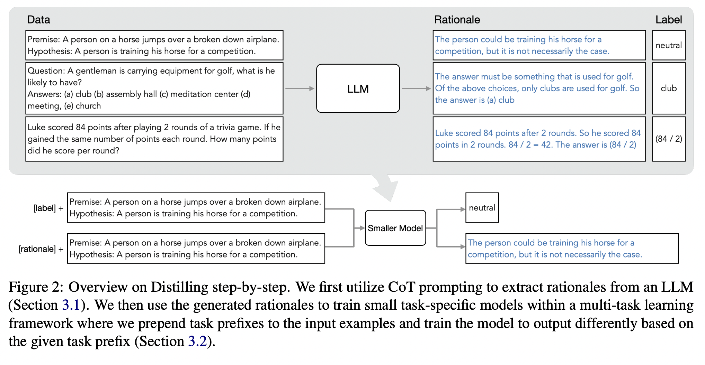

# Model distillation Learning Path

Goal: Create a distilled model of SantaCoder with flan-t5-small on the stack dataset: moonscript.

## 1. Understand Teacher Model and Student Model

### Teacher Model

Teacher Model: The [bigcode/santacoder](https://huggingface.co/bigcode/santacoder)

- 1.1B parameter, ~4.6G memory usegae for model weights
- trained on the **Python, Java, and JavaScript** subset of The Stack (v1.1)
- [Architecture](https://huggingface.co/bigcode/santacoder/blob/main/config.json):
  - GPT-2 model with multi-query attention and Fill-in-the-Middle objective
  - It uses a decoder-only transformer architecture
    "vocab_size": 49280}```
- Tokenizer: [GPT2TokenizerFast](https://huggingface.co/bigcode/santacoder/raw/main/tokenizer.json)
  - Vocabulary: 49280
  - context window of 2048 tokens

#### Use

it is not an **instruction model** and commands like "Write a function that computes the square root." do not work well. You should phrase commands like they occur in source code such as comments (e.g. # the following function computes the sqrt) or write a function signature and docstring and let the model complete the function body.

### Student Model:

Student Model: [google/flan-t5-small](https://huggingface.co/google/flan-t5-small)

- ~0.448G memory usegae for model weights
- Language model: research on zero-shot NLP tasks and in-context few-shot learning NLP tasks, such as reasoning, and question answering
- Architecture: T5ForConditionalGeneration
  - built on a transformer architecture with an encoder-decoder structure
- context window of 512 tokens
- [T5Tokenizer](https://huggingface.co/google/flan-t5-small/raw/main/tokenizer.json) Vocabulary: 32182

## 2. Distillcation Methods Research

I have not implemented any model distillations in my previous work, I did the following readings and research before I choosed the distillation methods.

- [Knowledge Distillation: A Survey](https://arxiv.org/pdf/2006.05525.pdf) 2021
- [A beginner’s guide to Knowledge Distillation in Deep Learning](https://analyticsindiamag.com/a-beginners-guide-to-knowledge-distillation-in-deep-learning/)

### Type of Knowledge Distillation

- response-based, Distillation is guided by the output layer (soft targets) of teacher model.
  - This method is suitable when the teacher and student models have similar architectures, especially when they have the same output layer. If the output layers are compatible, you can distill knowledge directly from the teacher's soft targets
- feature-based: the output and intermidate layers
  - If the teacher and student models have different architectures but share common intermediate layers, feature-based distillation may be effective.
- relation-based
  - This method can be useful when there is a specific type of relationship or structured information in the teacher model's predictions that you want the student to learn.

From my rapid learning, it appears that both the teacher model and the student model need to adhere to specific architectural requirements.

### Another one: Distillation step by step (U of Washington and Google)

- The larger model acts as a teacher and provides label and the rationales using Chain-of-Thought prompting (CoT) that aids a smaller student model during training. This is because LLMs with a large number of parameters tend to have better reasoning abilities.
- The student model learns to produce an output label and the rationale simultaneously given some input text (multi-task learning).
- This way, the student model learns to reason like the teacher and eliminates the need to deploy the teacher LLM completely during inference time.

Reference:

- [github repo: distilling-step-by-step](https://github.com/google-research/distilling-step-by-step)
- [youtube video: authors](https://www.youtube.com/watch?v=fnDUaDDrR4c)
- [paper review](https://pub.towardsai.net/distilling-step-by-step-paper-review-8bf1dcbbb500)

### Conclusion of distillation methods

I will use **Distillation step by step** for the following reasons:

- Model architecture agnoitic
- Good performance: could performs better than the teacher model.
- Less data

## 3. Raw Data

### The stack dataset overview

The stack dataset: moonscript

```
DatasetDict({
    train: Dataset({
        features: ['hexsha', 'size', 'ext', 'lang', 'max_stars_repo_path', 'max_stars_repo_name', 'max_stars_repo_head_hexsha', 'max_stars_repo_licenses', 'max_stars_count', 'max_stars_repo_stars_event_min_datetime', 'max_stars_repo_stars_event_max_datetime', 'max_issues_repo_path', 'max_issues_repo_name', 'max_issues_repo_head_hexsha', 'max_issues_repo_licenses', 'max_issues_count', 'max_issues_repo_issues_event_min_datetime', 'max_issues_repo_issues_event_max_datetime', 'max_forks_repo_path', 'max_forks_repo_name', 'max_forks_repo_head_hexsha', 'max_forks_repo_licenses', 'max_forks_count', 'max_forks_repo_forks_event_min_datetime', 'max_forks_repo_forks_event_max_datetime', 'content', 'avg_line_length', 'max_line_length', 'alphanum_fraction'],
        num_rows: 6159
    })
})
```

Examples

```
{'hexsha': 'aa46c61648d55a589bf23babaf6e5a7512dec49e',
 'size': 747,
 'ext': 'moon',
 'lang': 'MoonScript',
 'max_stars_repo_path': 'LunoPunk/tweens/sound/Fader.moon',
 'max_stars_repo_name': 'losinggeneration/LunoPunk',
 'max_stars_repo_head_hexsha': '225f54ba2fff458f9cdb23886cfe3f3e9dec9f22',
 'max_stars_repo_licenses': ['MIT'],
 'max_stars_count': 2,
 'max_stars_repo_stars_event_min_datetime': '2015-08-08T00:31:23.000Z',
 'max_stars_repo_stars_event_max_datetime': '2021-11-24T08:43:17.000Z',
 'max_issues_repo_path': 'LunoPunk/tweens/sound/Fader.moon',
 'max_issues_repo_name': 'losinggeneration/LunoPunk',
 'max_issues_repo_head_hexsha': '225f54ba2fff458f9cdb23886cfe3f3e9dec9f22',
 'max_issues_repo_licenses': ['MIT'],
 'max_issues_count': None,
 'max_issues_repo_issues_event_min_datetime': None,
 'max_issues_repo_issues_event_max_datetime': None,
 'max_forks_repo_path': 'LunoPunk/tweens/sound/Fader.moon',
 'max_forks_repo_name': 'losinggeneration/LunoPunk',
 'max_forks_repo_head_hexsha': '225f54ba2fff458f9cdb23886cfe3f3e9dec9f22',
 'max_forks_repo_licenses': ['MIT'],
 'max_forks_count': None,
 'max_forks_repo_forks_event_min_datetime': None,
 'max_forks_repo_forks_event_max_datetime': None,
 'content': 'import Tween from require "LunoPunk.Tween"\n\n-- Global volume fader.\nclass Fader extends Tween\n\t-- Constructor.\n\t-- @param\tcomplete\tOptional completion callback.\n\t-- @param\ttype\t\tTween type.\n\tnew: (complete, type)  =>\n\t\t-- Fader information.\n\t\t@__start, @__range = 0, 0\n\t\tsuper 0, type, complete\n\n\t-- Fades FP.volume to the target volume.\n\t-- @param\tvolume\t\tThe volume to fade to.\n\t-- @param\tduration\tDuration of the fade.\n\t-- @param\tease\t\tOptional easer function.\n\tfadeTo: (volume, duration, ease = nil) =>\n\t\tvolume = 0 if volume < 0\n\t\t@__start = LP.volume\n\t\t@__range = volume - @__start\n\t\t@__target = duration\n\t\t@__ease = ease\n\t\t@start!\n\n\t-- @private Updates the Tween.\n\tupdate: ()  =>\n\t\tsuper!\n\t\tLP.volume = @__start + @__range * @t\n\n{ :Fader }\n',
 'avg_line_length': 24.0967741935,
 'max_line_length': 49,
 'alphanum_fraction': 0.6626506024}
```

Content

```
-- Global volume fader.
class Fader extends Tween
	-- Constructor.
	-- @param	complete	Optional completion callback.
	-- @param	type		Tween type.
	new: (complete, type)  =>
		-- Fader information.
		@__start, @__range = 0, 0
		super 0, type, complete

	-- Fades FP.volume to the target volume.
	-- @param	volume		The volume to fade to.
	-- @param	duration	Duration of the fade.
	-- @param	ease		Optional easer function.
	fadeTo: (volume, duration, ease = nil) =>
		volume = 0 if volume < 0
		@__start = LP.volume
		@__range = volume - @__start
		@__target = duration
		@__ease = ease
		@start!

	-- @private Updates the Tween.
	update: ()  =>
		super!
		LP.volume = @__start + @__range * @t

{ :Fader }
```


## Distillation step by step


### Why FIM

Software engineering is rarely a linear task: programs are usually not written in one shot from start to end. Most day-to-day programming involves adding functionality, refactoring code, and fixing bugs—all tasks that benefit greatly from context after the cursor.
- [Efficient Training of Language Models to Fill in the Middle](https://arxiv.org/pdf/2207.14255.pdf)

### Data Sample Setup
1. Split the code into segments with a fixed length
2. Use gpt3 to explain the segment, it will be used as the rationale
3. Divide each segment into 3 parts: prefix, middle, postfix
4. Use santacoder to predict the middle part (**santacoder_outputs**) which will be used as label from teacher.

### Data Schema

| Feature   | Notes     | Example  |
|-----------|-----------|----------|
| santacoder_prompts | User prompts    | ```code...<FILL-HERE>...code```|
| fim_inputs | model input   | ```{FIM_PREFIX_TOKEN}{prefix code}{FIM_SUFFIX_TOKEN}{suffix_code}{FIM_MIDDLE_TOKEN}```|
| label_middles | The actual middle part   | ```middle code```|
| santacoder_outputs | Santacoder outputs for middle part   | ```middle code```|
| openai_rationale | Use OpenAI gpt3 to explain the code  | code explaination|

### Training
This part is modified based on [distillation step by step](https://github.com/google-research/distilling-step-by-step)

## How To Run

1. Install dependency
```
pip install -r requirements.txt
```

2. Prepare training dataset. This step takes time and I already uploaded a small dataset to huggingface [link](https://huggingface.co/datasets/jitx/distillation_code_100) which could be used in the next step for demo purpose. 
```
python3 data_generation.py --model bigcode/santacoder --dataset bigcode/the-stack --seq_length 1024 --split train --data_subset_path data/moonscript --run 46 --push_to_hub --save_local --nosample 100
``` 
3. Distiilation
```
python3 distill_step_by_step.py --dataset jitx/distillation_code_100 --subsample 1 --alpha 0.2 --max_steps 10 --eval_steps 1 --batch_size 1 --from_pretrained google/flan-t5-small --model_type task_prefix --output_rationale
```

## Issues
- T5Tokenizer does not handle space.
- Need to find better metrics to measure the accuracy.
	- [llm-code-eval](https://github.com/terryyz/llm-code-eval)
- T5 generate empty response.
- Not sure if the use of rationale for code completion model makes sense or not.
